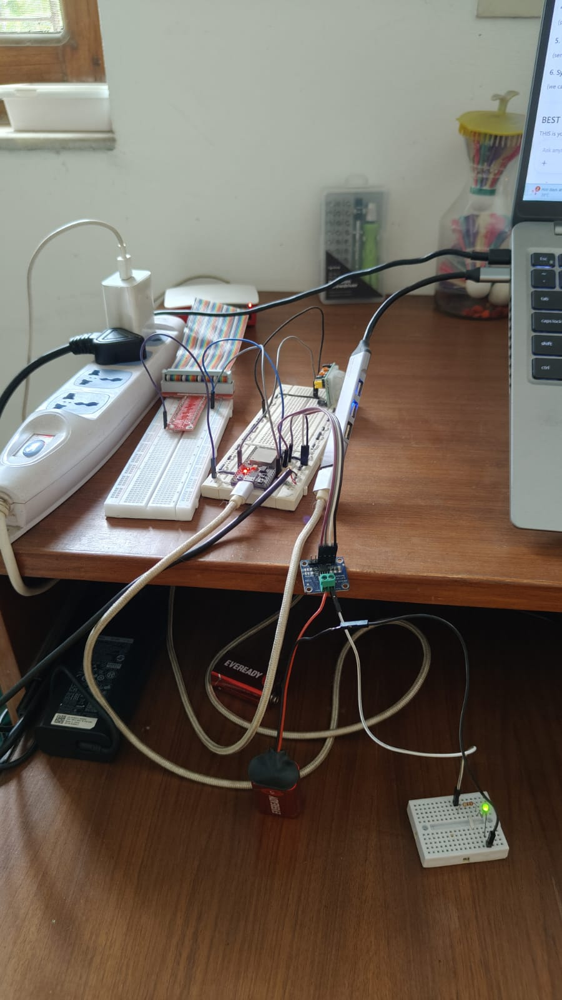
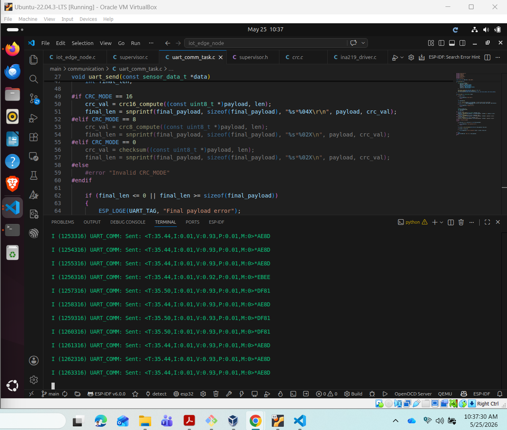
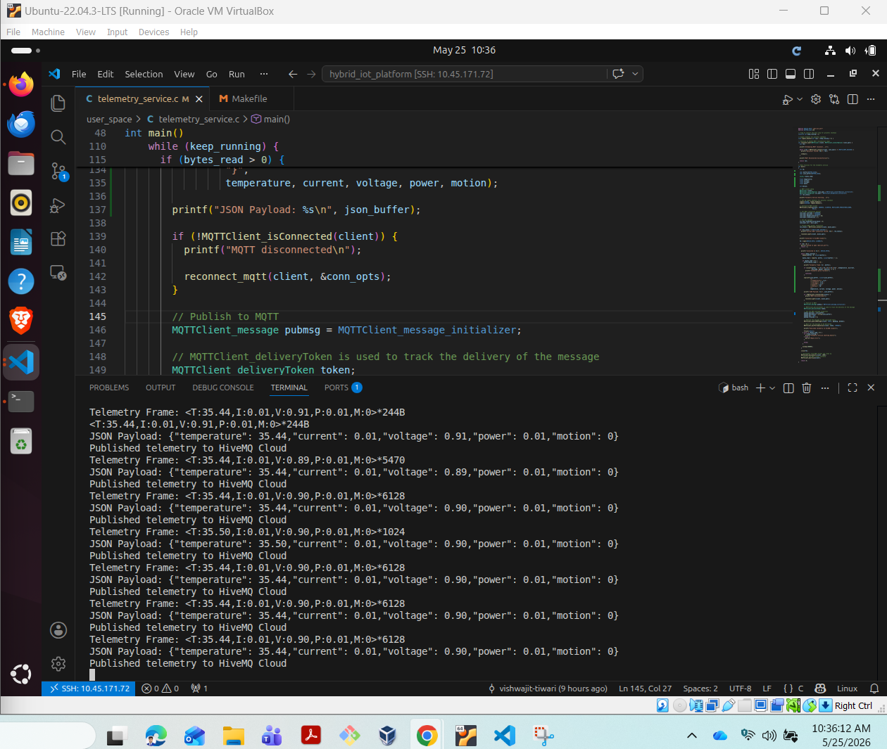
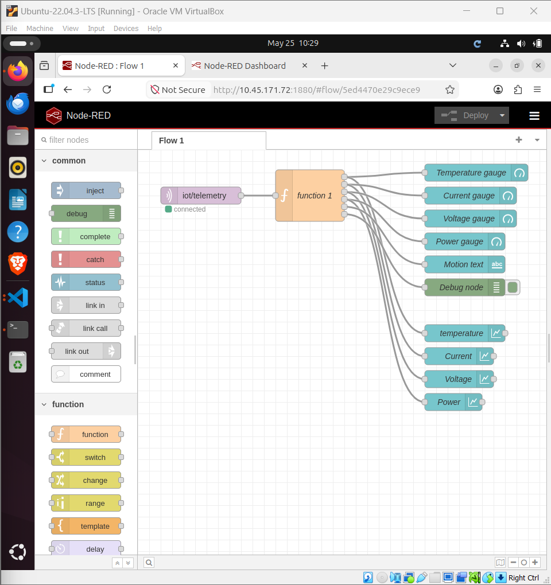
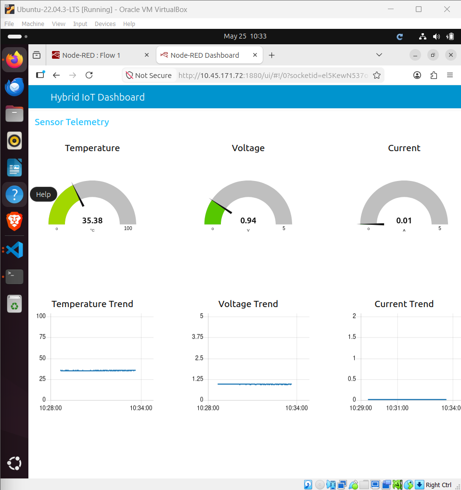

# Hybrid Linux–RTOS IoT Edge Platform


---

## Project Overview

M.Tech Project – BITS Pilani WILP

This project implements a Hybrid Linux–RTOS IoT Edge Platform using:

- ESP32 running FreeRTOS
- Raspberry Pi 4B running Linux
- Custom Linux UART Character Driver
- UART framed telemetry protocol
- CRC-based frame integrity validation
- MQTT cloud telemetry publishing
- Node-RED dashboard visualization

The platform demonstrates:

- hybrid embedded architecture
- Linux kernel driver development
- RTOS task management
- UART middleware design
- cloud telemetry integration
- real-time sensor monitoring

---

## Technology Stack

| Domain | Technologies |
|---|---|
| RTOS | FreeRTOS |
| MCU | ESP32 |
| SBC | Raspberry Pi 4B |
| Kernel Development | Linux Character Driver |
| Communication | UART |
| Integrity Validation | CRC16 / CRC8 |
| Cloud Protocol | MQTT |
| Cloud Broker | HiveMQ Cloud |
| Dashboard | Node-RED |
| Language | Embedded C |

---

## System Architecture

```text
ESP32 (FreeRTOS)
    ↓ UART Telemetry Frames
Linux UART Driver
    ↓
Frame Parser + CRC Validation
    ↓
kfifo Buffered Middleware
    ↓
User-space MQTT Publisher
    ↓
HiveMQ Cloud Broker
    ↓
Node-RED Dashboard
```

---

## Runtime Data Flow

```text
DS18B20 / INA219 / PIR Sensors
              ↓
        ESP32 FreeRTOS Tasks
              ↓
      UART Framed Telemetry
              ↓
 Raspberry Pi Linux UART Driver
              ↓
 Frame Parsing + CRC Validation
              ↓
      kfifo Telemetry Buffer
              ↓
     /dev/iot_uart Interface
              ↓
   User-space Telemetry Service
              ↓
      HiveMQ Cloud Broker
              ↓
       Node-RED Dashboard
```

---

## Features

### ESP32 RTOS Features

- FreeRTOS multitasking
- DS18B20 temperature sensing
- INA219 voltage/current/power sensing
- PIR motion detection
- UART telemetry transmission
- supervisor framework
- heartbeat monitoring

### Linux Driver Features

- custom Linux character device driver
- kfifo buffering
- blocking/non-blocking I/O
- poll/select support
- wait queue synchronization
- UART kernel thread
- CRC/frame validation
- stream-oriented telemetry parsing
- fragmented frame reconstruction
- producer-consumer telemetry buffering model
- safe kernel thread termination

### User-space Telemetry Service

- reads validated telemetry frames from `/dev/iot_uart`
- continuous telemetry monitoring
- MQTT cloud publishing
- graceful shutdown handling
- MQTT reconnect support

### Cloud Integration

- HiveMQ Cloud MQTT broker
- MQTT telemetry publishing
- Node-RED dashboard visualization
- real-time telemetry monitoring

---

## Key Engineering Highlights

- Custom Linux UART character device driver
- RTOS-to-Linux hybrid telemetry architecture
- CRC16-based telemetry integrity validation
- asynchronous poll/select driver support
- kfifo-based producer-consumer buffering
- wait queue synchronization
- UART stream reassembly and frame synchronization
- MQTT cloud telemetry integration
- Node-RED real-time telemetry dashboard
- graceful driver shutdown and recovery handling

---

## Hardware Used

| Component | Purpose |
|---|---|
| ESP32-WROOM | RTOS telemetry node |
| Raspberry Pi 4B (4GB) | Linux edge gateway |
| DS18B20 | Temperature sensing |
| INA219 | Voltage/current/power sensing |
| PIR Sensor | Motion detection |

---

## UART Telemetry Protocol

Example telemetry frame:

```text
<T:30.12,I:0.02,V:0.99,P:0.02,M:0>*5BD7
```

### Frame Structure

```text
<sensor_payload>*CRC
```

### Example

```text
<T:30.12,I:0.02,V:0.99,P:0.02,M:0>*5BD7
```

### Protocol Features

- framed UART packets
- configurable integrity modes
- CRC16 / CRC8 / checksum support
- stream synchronization
- packet validation
- CRC16-CCITT integrity validation
- cross-platform Linux/ESP32 CRC compatibility

---

## Linux Driver Runtime Pipeline

```text
ESP32 UART Stream
        ↓
UART RX Kernel Thread
        ↓
Frame Synchronization Parser
        ↓
Validated Telemetry Frame
        ↓
kfifo Buffer
        ↓
Character Device (/dev/iot_uart)
        ↓
User-space Reader
```

### Example Runtime Telemetry

```text
<T:36.00,I:0.02,V:0.96,P:0.02,M:0>*8BEC
```

---

## Current Project Status

### Completed

- ESP32 RTOS telemetry framework
- UART communication validation
- Raspberry Pi UART configuration
- Linux character driver
- UART RX kernel thread
- frame synchronization parser
- kfifo validated buffering
- poll/select support
- blocking/non-blocking reads
- safe module unload handling
- asynchronous I/O support
- hardware telemetry validation
- UART hardware configuration validation
- verified ESP32 ↔ Raspberry Pi telemetry streaming
- CRC16 telemetry integrity verification
- live framed telemetry reception over ttyAMA0
- user-space telemetry service
- kernel-to-user telemetry pipeline
- live telemetry frame consumption
- HiveMQ MQTT integration
- Node-RED dashboard integration

---

## Current Runtime Validation

- CRC16 telemetry validation fully operational
- stream-based UART frame synchronization implemented
- validated telemetry buffering pipeline operational
- real-time ESP32 → Linux telemetry reception verified
- FIFO overflow handling implemented
- UART raw-mode runtime stabilization

---

## Engineering Challenges Solved

- UART stream fragmentation handling
- partial frame reconstruction
- cross-platform CRC16 compatibility
- FIFO overflow protection
- blocking vs non-blocking synchronization
- UART raw mode stabilization
- safe kernel thread termination
- graceful driver unload handling

---

## Build Instructions

### Build Linux Driver

```bash
cd kernel_driver
make
```

### Build User-space Application

```bash
cd user_space
make
```

---

## Running the Platform

Run from project root:

```bash
chmod +x scripts/start_demo.sh

./scripts/start_demo.sh
```

The script automatically:

- configures UART raw mode
- reloads kernel driver
- starts telemetry service
- starts Node-RED dashboard
- initializes MQTT telemetry pipeline

---

## Node-RED Dashboard

Dashboard URL:

```text
http://<RPI_IP>:1880/ui
```

---

## Demo Execution

Automated demo startup:

```bash
./scripts/start_demo.sh
```

Example runtime output:

```text
<T:30.81,I:0.01,V:0.97,P:0.01,M:0>*606C
```

---

# Screenshots

## Hardware Setup



---

## ESP32 Runtime (UART Telemetry Transmission)



---

## Linux Telemetry Runtime



---

## Node-RED Flow



---

## Real-Time Dashboard UI



---

# Demo Videos

## End-to-End System Demonstration

[▶ Watch End-to-End Demo](demo_videos/end_to_end_demo.mp4)

---

## Hardware Demonstration

[▶ Watch Hardware Demo](demo_videos/hardware_demo.mp4)

---

## Repository Structure

```text
hybrid_iot_platform/
├── kernel_driver
│   ├── crc
│   │   ├── checksum.c
│   │   ├── crc16.c
│   │   ├── crc8.c
│   │   ├── integrity.h
│   │   └── validator.c
│   ├── parser
│   │   ├── frame_parser.c
│   │   └── frame_parser.h
│   ├── iot_uart_driver_main.c
│   └── Makefile
│
├── scripts
│   └── start_demo.sh
│
├── user_space
│   ├── Makefile
│   └── telemetry_service.c
│
├── screenshots
│
└── README.md
```

---

## Author

Vishwajit Kumar Tiwari  
M.Tech – Embedded Systems  
BITS Pilani WILP

### Connect

- LinkedIn: [Vishwajit Kumar Tiwari](https://www.linkedin.com/in/vishwajit-tiwari/)
- GitHub: [vishwajit-tiwari](https://github.com/vishwajit-tiwari)